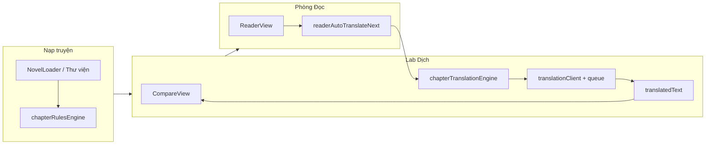

# HANDOFF v4 — Novel Translator for Fun (mobile_v3)

> **Đã lỗi thời.** Dùng **[HANDOFF-v5.md](./HANDOFF-v5.md)** làm nguồn chính (gồm `translatedTitle` / PA1 tiêu đề cùng request).

**Mục đích:** Prompt/onboarding cho **AI agent mới** trước khi chỉnh sửa tiếp.  
**Phiên chat gốc:** [Novel Translator mobile v3](4aaac939-a29c-46f5-838a-6fe3518a9adc) — transcript trong `agent-transcripts/` nếu cần lịch sử chi tiết.  
**Cập nhật:** 2026-05-24 — sau Lab-first, `chapterTranslationEngine`, auto-dịch chương kế (phương án A).

---

## 0. Đọc trước khi code (30 giây)

| Việc | Quy tắc |
|------|---------|
| Ngôn ngữ trả lời user | **Tiếng Việt** |
| Commit git | **Chỉ khi user yêu cầu** — workspace có thể không phải git repo |
| Phạm vi diff | **Tối thiểu** — không refactor lan man |
| Nguồn dịch chuẩn | **`Chapter.translatedText` từ Lab** — không dùng `page_trans` làm song ngữ chính |
| Cấu trúc dòng | **1 dòng Hán = 1 dòng Việt** — validate sau mỗi lần dịch chương |
| Theme UI | **Shell** (`ui.*`, `appColorScheme`) ≠ **Phòng Đọc** (`settings.theme`) — không restyle Reader khi task chỉ sửa shell |

---

## 1. Sản phẩm là gì

**Novel Translator for Fun** — app đọc/dịch truyện **Trung → Việt** (tiên hiệp / cổ phong), chạy:

- **Web:** Vite dev + `server.ts` (tùy chọn)
- **Android:** Capacitor 8, package `com.nguyenthaidung.noveltranslator`
- **Workspace:** `e:\v24.5.2026 mobile_v3`

Ba “phòng” chính:



| Phòng | Vai trò |
|-------|---------|
| **Thư viện / NovelLoader** | Tải `.txt`, tách chương (regex Legado-style), lưu `Novel` + `Chapter[]` |
| **Lab Dịch** | Song ngữ Hán–Việt, «Dịch chương», batch, sửa `translatedText` |
| **Phòng Đọc** | Đọc theo trang/viewport; **hiển thị** bản Lab; tùy chọn **tự dịch chương kế** |

---

## 2. Stack & lệnh thường dùng

| Thành phần | Phiên bản / ghi chú |
|------------|---------------------|
| React | 19 |
| Vite | 6 |
| Capacitor | 8 |
| TypeScript | ~5.8 |
| Persistence | `idb` qua `src/lib/persistence.ts` — key `novels`, `settings`, `page_trans_*`, … |
| JDK Android | **21** (bắt buộc; script trỏ `Microsoft jdk-21`) |

```powershell
cd "e:\v24.5.2026 mobile_v3"
npm run lint          # tsc --noEmit
npm run qa            # 55 kịch bản — phải pass trước khi ship
npm run build
npx cap sync android

# APK release (một lệnh)
npm run android:release

# Test tách chương file lớn
npx tsx scripts/test-chapter-rules-on-file.mjs "fixtures/Tam tan ky.txt"
```

**Mở Android Studio:** `File → Open` → folder **`android/`** (không mở root React). Sau mỗi đổi frontend: `npm run build` + `npx cap sync android`.

---

## 3. Mô hình dữ liệu

```typescript
// src/types.ts (rút gọn)
interface Chapter {
  id: string;
  title: string;
  sourceText: string;      // Hán gốc — căn dòng theo \n
  translatedText: string;  // Việt Lab — NGUỒN CHUẨN song ngữ
  charCount: number;
  wordCount: number;
}

interface Novel {
  chapters: Chapter[];
  rawTextSource?: string;
  chapterHeaderPattern?: string;
  chapterRuleStates?: ...; // trong settings, merge khi upload
  lastReadChapterId?, lastReadPageIndex?, lastReadMode?;
}
```

**Không tin** `page_trans_*` cho CompareView / song ngữ chính (legacy có thể còn trong VFS).

---

## 4. Pipeline dịch thuật (TRỌNG TÂM v3→v4)

### 4.1 `translateChapter` — `src/utils/chapterTranslationEngine.ts`

| Tầng | Điều kiện | Hành vi |
|------|-----------|---------|
| **A — single** | ≤ **7.000** ký tự **và** ≤ **150** dòng | 1 request + prefix “đúng N dòng” |
| **B — chunked** | Vượt ngưỡng trên, hoặc > **12.000** ký tự / > **250** dòng | Chia **100 dòng**/request, ghép `\n` |
| **Fallback** | Single lỗi số dòng | Tự chuyển B một lần |
| **Sau mỗi đoạn** | `validateTranslationLineCount` | Sai → **1 retry** chỉnh cấu trúc dòng |

**Lưu ý:** 100 dòng **không** = 100 chữ. Ước lượng ~**3.000–6.000** chữ Hán/khối (web novel); dòng dài có thể ~8.000–12.000.

**Hằng số export:** `TIER_A_MAX_CHARS`, `TIER_A_MAX_LINES`, `TIER_B_LINES_PER_CHUNK`, `FORCE_CHUNK_CHARS`, `FORCE_CHUNK_LINES`.

### 4.2 `translationClient.ts`

- `buildSystemInstruction` — đại từ Hán–Việt, **1 dòng = 1 dòng**, Hán Việt cổ phong, không trợ từ đời thường.
- Gọi API trực tiếp từ WebView/APK (Gemini, OpenAI, DeepSeek, Qwen, Claude).
- `translationQueue.ts` — **1 worker**, gap ≥ ~1.4s (`TRANSLATION_QUEUE_MIN_GAP_MS`).
- `apiQuotaTracker.ts` — xoay key, cooldown 429.

### 4.3 Ai gọi `translateChapter`?

| Nơi | Ghi chú |
|-----|---------|
| `App.tsx` — `handleTranslateActiveChapter`, `runBatchChapterTranslation` | Lab + batch |
| `readerAutoTranslateNext.ts` — `runAutoTranslateNextChapter` | Phòng Đọc, priority `low` |

**Không** gọi `translateText` cả chương từ Reader cho song ngữ (đã tắt dịch theo trang).

---

## 5. Tự dịch chương kế — phương án A (v4 mới)

**File:** `src/utils/readerAutoTranslateNext.ts` + logic trong `ReaderView.tsx`.

**Settings** (`TranslationSettings`):

- `readerAutoTranslateNextEnabled` — **mặc định `false`**
- `readerAutoTranslateNextDelaySec` — **mặc định 30**, UI tối thiểu **10** (blur < 10 → `alert`)

**UI:** Phòng Đọc → ⚙ **Cấu hình Trang Sách** → switch + ô giây.

### Luồng hành vi (bắt buộc hiểu đúng)

```text
Nhảy cóc (menu ⋯ 20→50)     → sequentialArmed = false → KHÔNG auto dịch 21
Bấm Chương sau 50→51       → sequentialArmed = true
Ở chương 51 đủ x giây      → auto dịch chương 52 (C+1) qua translateChapter, lưu translatedText
Bấm Chương sau để đọc 52   → chỉ điều hướng; KHÔNG cần bấm thêm chỉ để “kích hoạt dịch 52”
```

| Cơ chế | Chi tiết |
|--------|----------|
| `goToChapter(id, navKind)` | `adjacent-next` / `adjacent-prev` / `jump` / `initial` |
| Timer | Reset mỗi đổi chương; pause khi drawer chương, settings, `document.hidden` |
| Một lần / cặp | `triggeredSourceKeys` — mỗi chương nguồn chỉ schedule dịch C+1 một lần |
| Lưu kết quả | `App.handleReaderChapterTranslated` → `persistChapterTranslation` |

**Case user hay hỏi:** Đọc 50 xong → Next → 51; đọc 51 đủ x giây → **52 tự dịch ngầm**, không cần bấm Next chỉ để dịch 52.

---

## 6. Lab Dịch & CompareView

### Lab

- Chỉ hiển thị `activeChapter.translatedText` (không ghép `page_trans` trong `labDisplayTranslation` effect).
- Đổi chương **không** tự gọi AI — user bấm «Dịch chương» hoặc batch.
- `CompareView` — `splitAlignedLines` theo **index dòng** `\n`; banner vàng nếu `formatLineMismatchWarning` báo lệch.

### Nguyên nhân lệch dòng (đã phân tích, chưa smart-align)

1. Model gộp/tách dòng dù prompt đúng.
2. Trước đây Reader `page_trans` ≠ lưới `sourceText` (đã Lab-first).
3. Newline / dòng trống.

**Backlog (chưa làm trừ khi user yêu cầu):** smart align, ép retry mạnh hơn, UI “chỉ Lab” trong Reader rõ hơn.

---

## 7. Tách chương khi upload `.txt`

| File | Vai trò |
|------|---------|
| `chapterRulesCatalog.ts` | ~19 rule Legado-style; **6 bật mặc định** |
| `chapterRulesEngine.ts` | `parseChaptersWithRules`, merge state, lọc false positive |
| `ChapterRulesPanel.tsx` | UI bật/tắt, reorder, preview |
| `chapterParser.ts` | Ưu tiên rule engine → fallback heuristic |

**Fixture quan trọng:** `fixtures/Tam tan ky.txt` (~296 chương `第X卷|第Y章`). Rule `num-separator` có thể match artifact `00-00ui` — user nên tắt rule đó, chỉ `目录` + `目录(去空白)`.

**Script:** `scripts/test-chapter-rules-on-file.mjs`

---

## 8. Phòng Đọc — UX đã làm (v1–v3 thread)

- **Một nút Back** ra shell — `isReaderImmersive` ẩn header App trùng.
- **Phân trang theo viewport** — `computeReaderPageViewport`, không cuộn dọc trong một “trang”.
- **Menu chương** (⋯), auto-hide bar, nhớ `last_read_*`.
- **Chưa có Lab:** hiển thị **bản Hán** + banner hướng dẫn (page + scroll).
- **Đã có Lab:** paginate `translatedText`.

**Không** tự dịch từng trang / prefetch trang (đã gỡ).

---

## 9. API & free tier (Gemini)

- Giới hạn thường gặp: **5 RPM / 20 RPD** mỗi key free.
- **Ưu tiên đếm request/chương**, không chỉ token.
- Khuyến nghị user: `maxThreads: 1`, batch nhỏ, bật auto chương kế cẩn thận (mỗi chương kế = 1–4 request).

---

## 10. Bản đồ file then chốt

```
src/
  App.tsx                          # orchestration, Lab batch, persist novels
  types.ts
  components/
    ReaderView.tsx                 # đọc + auto chương kế + settings reader
    CompareView.tsx
    NovelLoader.tsx, StoryLibrary.tsx
    ChapterRulesPanel.tsx
    SettingsTab.tsx, VFSManager.tsx
  utils/
    chapterTranslationEngine.ts  # ★ dịch chương tier A/B
    readerAutoTranslateNext.ts     # ★ auto C+1 phương án A
    translationClient.ts
    translationQueue.ts
    apiQuotaTracker.ts
    chapterRulesEngine.ts, chapterRulesCatalog.ts
    chapterParser.ts
    chapterTranslationBridge.ts  # readiness badge; page_trans legacy
    bilingualAlignment.ts, dictLookup.ts
    workspaceNavigation.ts
scripts/
  qa-user-scenarios.mjs            # 55 tests
  build-android-release.ps1
  test-chapter-rules-on-file.mjs
fixtures/
  Tam tan ky.txt, test-novel-cn.txt
android/                           # Capacitor — mở trong Android Studio
```

---

## 11. QA & chất lượng

```powershell
npm run lint   # bắt buộc pass
npm run qa     # 55 passed (v4)
```

**Cảnh báo sản phẩm (không fail build):** NovelLoader URL web = mock 10 chương; cần API key thật trên APK; auto chương kế tốn RPD.

---

## 12. Android / hiệu năng

- `npm run android:release` → `version:sync`, `build`, `cap sync`, `gradlew assembleRelease`.
- Warning `flatDir` Gradle — **vô hại** (Capacitor).
- APK nóng máy (đã phân tích): bundle JS lớn, prefetch/blur cũ, `animate-pulse` — không chủ yếu do shell `ui.*`.

---

## 13. Tiến hóa handoff v1 → v4 (tóm tắt)

| Version | Trọng tâm |
|---------|------------|
| **v1** | Reader UX: back, viewport pages, drawer, last-read |
| **v2** | Shell `ui.*`, integration audit, APK build |
| **v3** | Chapter rules, Tam tan ky, CompareView lệch dòng, chiến lược Lab 1 req/chương (thiết kế) |
| **v4** | **Đã code:** `chapterTranslationEngine`, Lab-first, CompareView warning, **auto chương kế A**, QA 55 |

---

## 14. Backlog ưu tiên (user chưa bắt buộc)

1. Lọc `00-00ui` / siết `num-separator` trong rule engine.
2. CompareView smart-align hoặc chỉ highlight dòng lệch.
3. Migrate `App.tsx` modal còn `zinc-*` → `ui.*`.
4. Tối ưu nhiệt/APK (bundle split, giảm animation).
5. Cào URL thật cho NovelLoader (hiện mock).

---

## 15. Pitfalls — ĐỪNG

- Dùng `page_trans` làm bản dịch chính cho song ngữ / CompareView.
- Dịch từng dòng hoặc từng trang Reader cho cả chương (tốn RPD, lệch dòng).
- Gộp hai chương trong một request khi user cần căn dòng.
- Restyle `ReaderView` theme khi task chỉ “sửa menu/Lab”.
- `git commit` / `push --force` không được user yêu cầu.
- Assume repo có git — kiểm tra trước.
- Undo chat khác **không** đảm bảo revert disk — tin **file trên disk** + `git status`.

---

## 16. Prompt gợi ý cho agent mới (copy-paste)

```text
Bạn tiếp quản Novel Translator for Fun tại e:\v24.5.2026 mobile_v3.
Đọc HANDOFF-v4.md và chạy npm run lint && npm run qa trước khi sửa.

Tôn trọng:
- Lab.translatedText = nguồn song ngữ; translateChapter (tier A/B theo dòng).
- Reader: không page_trans API; auto chương kế phương án A (nhảy ⋯ không auto; Next liền kề → đủ x giây → dịch C+1).
- Trả lời tiếng Việt; diff tối thiểu; không commit trừ khi tôi yêu cầu.

Nhiệm vụ hiện tại: [USER ĐIỀN]
```

---

## 17. Transcript & handoff cũ

- Transcript đầy đủ: `agent-transcripts/4aaac939-a29c-46f5-838a-6fe3518a9adc/4aaac939-a29c-46f5-838a-6fe3518a9adc.jsonl`
- v1/v2/v3 có thể chỉ nằm trong chat — **v4 supersede** cho trạng thái code hiện tại; dùng v4 làm nguồn chính, transcript khi cần lý do lịch sử.

---

*Hết HANDOFF v4.*
