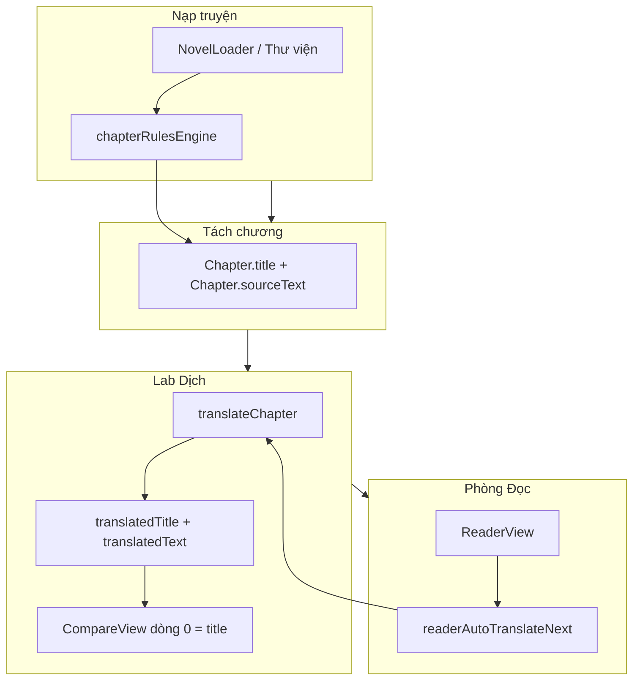

# HANDOFF v5 — Novel Translator for Fun (mobile_v3)

**Mục đích:** Onboarding cho **AI agent mới** trước mọi chỉnh sửa tiếp theo.  
**Phiên chat gốc:** [Novel Translator mobile v3](4aaac939-a29c-46f5-838a-6fe3518a9adc) — transcript trong `agent-transcripts/` khi cần lịch sử.  
**Nguồn chính:** **v5 supersede v4** (2026-05-24). v1–v3 nằm trong chat/transcript; không cần đọc lần lượt nếu đã đọc v5.

---

## 0. Đọc trước khi code (30 giây)

| Việc | Quy tắc |
|------|---------|
| Ngôn ngữ trả lời user | **Tiếng Việt** |
| Commit git | **Chỉ khi user yêu cầu** — workspace có thể không phải git repo |
| Phạm vi diff | **Tối thiểu** — không refactor lan man |
| Nguồn dịch chuẩn | **`translatedTitle` + `translatedText`** từ Lab (`translateChapter`) |
| Cấu trúc dòng | **1 dòng Hán = 1 dòng Việt**; dòng 0 CompareView = **tiêu đề** (không nằm trong `sourceText` thân) |
| `page_trans` | Legacy — **không** dùng cho song ngữ / CompareView |
| Theme UI | **Shell** (`ui.*`, `appColorScheme`) ≠ **Phòng Đọc** (`settings.theme`) |

---

## 1. Sản phẩm

**Novel Translator for Fun** — đọc/dịch truyện **Trung → Việt** (tiên hiệp, cổ phong, Hán Việt).

| Kênh | Ghi chú |
|------|---------|
| Web | Vite + React; `server.ts` tùy chọn |
| Android | Capacitor 8 — `com.nguyenthaidung.noveltranslator` |
| Workspace | `e:\v24.5.2026 mobile_v3` |



| Phòng | Vai trò |
|-------|---------|
| **Thư viện / NovelLoader** | `.txt` → tách chương (regex Legado-style) |
| **Lab Dịch** | Song ngữ, «Dịch chương», batch, hiệu đính |
| **Phòng Đọc** | Đọc viewport/trang; hiển thị Lab; tùy chọn **tự dịch chương kế** |

---

## 2. Mô hình dữ liệu `Chapter` (quan trọng)

Khi tách chương (`chapterRulesEngine.splitByRules`):

- **`title`** = dòng header (vd. `第一章 山王初现`) — **không** nằm trong `sourceText`
- **`sourceText`** = **thân chương** (các dòng sau header)

```typescript
// src/types.ts (rút gọn)
interface Chapter {
  id: string;
  title: string;              // Hán — tiêu đề
  sourceText: string;           // Hán — thân
  translatedTitle?: string;     // Việt — tiêu đề (dòng 0 khi dịch)
  translatedText: string;       // Việt — thân — song ngữ thân
  charCount: number;
  wordCount: number;            // đếm theo sourceText
}
```

**Migration nhẹ:** Chương cũ không có `translatedTitle` → Reader fallback cache `reader_chapter_title_translations` + `translatePhrase` (1 request/chương nếu chưa cache). **Dịch lại** chương trong Lab để có `translatedTitle` đầy đủ.

---

## 3. Pipeline dịch — `chapterTranslationEngine.ts`

### 3.1 Gộp tiêu đề + thân (PA1 — v5)

**Một request** gửi:

```text
{chapterTitle}\n{sourceText}
```

**Kết quả** (`ChapterTranslationResult`):

- Dòng 1 → `translatedTitle`
- Các dòng sau → `translatedText`

Helpers export:

| Hàm | Vai trò |
|-----|---------|
| `buildChapterSourceWithTitle` | Gộp payload API |
| `splitChapterTranslationResult` | Tách sau dịch |
| `buildCompareBilingualTexts` | CompareView: synthetic dòng 0 |
| `parseCompareTranslationSave` | Lưu sửa tay từ CompareView |

Prompt chunk 1: nhắc *“Dòng 1 là tiêu đề chương…”* (`buildLineCountUserPrefix` khi `startLine === 1`).

**Tiết kiệm API:** Trước đây Reader gọi **`translatePhrase(title)`** riêng (+1 RPD/chương); giờ Lab/batch/auto **không** thêm request cho tiêu đề.

### 3.2 Tier A / B (thân + tiêu đề trong cùng lưới dòng)

| Tầng | Điều kiện (trên chuỗi **đã gộp**) | Hành vi |
|------|-----------------------------------|---------|
| **A** | ≤ **7.000** ký tự **và** ≤ **150** dòng | 1 request |
| **B** | Vượt A, hoặc > **12.000** ký tự / > **250** dòng | Chia **100 dòng**/request |
| **Fallback** | A lỗi số dòng | Thử B một lần |
| **Validate** | Mỗi đoạn | `validateTranslationLineCount` + **1 retry** chỉnh dòng |

**100 dòng ≈ bao nhiêu chữ?** Không cố định — chia theo **dòng**:

| Kiểu dòng | ~Chữ/dòng | 100 dòng ≈ |
|----------|-----------|------------|
| Ngắn | 15–30 | 1.5k–3k |
| Vừa (web novel) | 40–60 | 4k–6k |
| Dài | 80–120 | 8k–12k |

Hằng số: `TIER_A_MAX_CHARS`, `TIER_A_MAX_LINES`, `TIER_B_LINES_PER_CHUNK`, `FORCE_CHUNK_*`.

### 3.3 `translationClient.ts` + hàng đợi

- `buildSystemInstruction` — đại từ, **1:1 dòng**, cổ phong, không trợ từ đời thường.
- API trực tiếp từ client (Gemini, OpenAI, DeepSeek, Qwen, Claude).
- `translationQueue.ts` — **1 worker**, `TRANSLATION_QUEUE_MIN_GAP_MS` ≥ 1s.
- `translatePhrase` — **chỉ** Reader fallback tiêu đề khi chưa có `translatedTitle` (lookup ngắn, ~100 tokens).

### 3.4 Ai gọi `translateChapter`?

| Caller | `chapterTitle` | Priority |
|--------|----------------|----------|
| `App` — Dịch chương / batch | `ch.title` | normal |
| `readerAutoTranslateNext` | `nextChapter.title` | low |
| Reader **không** dịch thân qua API trang | — | — |

---

## 4. Lab Dịch & CompareView

- `labDisplayTranslation` = chỉ `translatedText` (không ghép `page_trans`).
- Header Lab: `title` + ` — translatedTitle` (nếu có).
- `CompareView`: props `chapterTitle`, `translatedTitle`, `sourceText`, `translatedText`; căn dòng trên bản **gộp hiển thị**.
- `formatLineMismatchWarning(chapterTitle, sourceText, translatedTitle, translatedText)`.
- Đổi chương Lab **không** auto AI — user «Dịch chương» / batch.
- `handleUpdateTranslation` nhận `ChapterTranslationResult` hoặc `string` (legacy chỉ body).

**Lệch dòng (đã biết):** `splitAlignedLines` theo index `\n`; model gộp/tách vẫn có thể lỗi → banner vàng. **Chưa** smart-align.

---

## 5. Phòng Đọc

### 5.1 Lab-first đọc nội dung

- Có `translatedText` → paginate bản Việt.
- Chưa có → hiển thị **Hán** (`sourceText`) + banner hướng dẫn Lab.
- **Không** API `page_trans` / prefetch trang.

### 5.2 Tiêu đề hiển thị

1. `chapter.translatedTitle` (từ Lab) — **ưu tiên**
2. `localStorage` `reader_chapter_title_translations` (key = title Hán)
3. `translatePhrase` + heuristic `第N章` → `Chương N:` (legacy, **+1 request** nếu cần)

Khi Lab đã dịch chương → sync cache local từ `translatedTitle`, **không** gọi API tiêu đề.

### 5.3 Tự dịch chương kế — phương án A

**Files:** `readerAutoTranslateNext.ts`, `ReaderView.tsx` (`goToChapter`, timer).

**Settings** (mặc định **tắt**):

- `readerAutoTranslateNextEnabled: false`
- `readerAutoTranslateNextDelaySec: 30` (UI min **10**, blur < 10 → `alert`)

**UI:** ⚙ Cấu hình Trang Sách → switch + ô giây.

```text
Nhảy cóc (menu ⋯ 20→50)  → sequentialArmed = false → không auto dịch 21
Next 50→51                 → sequentialArmed = true
Ở 51 đủ x giây            → auto dịch 52 (translateChapter + translatedTitle)
Next để đọc 52            → chỉ điều hướng; 52 có thể đã dịch sẵn
```

| Cơ chế | Chi tiết |
|--------|----------|
| `goToChapter(id, navKind)` | `adjacent-next` \| `adjacent-prev` \| `jump` \| `initial` |
| Timer | Reset đổi chương; pause: drawer ⋯, settings, `document.hidden` |
| Dedup | `triggeredSourceKeys` / `inFlightKeys` per novel+chapter |
| Lưu | `persistChapterTranslation` → cả `translatedTitle` + `translatedText` |

### 5.4 UX Reader (v1→v4, vẫn hiệu lực)

- Một nút Back (`isReaderImmersive`).
- Phân trang viewport (`computeReaderPageViewport`).
- Menu chương ⋯, auto-hide bar, `last_read_*`.

---

## 6. Tách chương `.txt`

| File | Vai trò |
|------|---------|
| `chapterRulesCatalog.ts` | ~19 rule; **6 bật mặc định** |
| `chapterRulesEngine.ts` | `parseChaptersWithRules`, lọc false positive |
| `ChapterRulesPanel.tsx` | UI rule |
| `chapterParser.ts` | Rule engine trước, heuristic sau |

**Tam tan ky:** `fixtures/Tam tan ky.txt` — ~296 chương. Rule `num-separator` dễ match `00-00ui` → tắt, chỉ dùng `目录` + `目录(去空白)`.

```powershell
npx tsx scripts/test-chapter-rules-on-file.mjs "fixtures/Tam tan ky.txt"
```

---

## 7. API free tier & vận hành

- Gemini free thường **5 RPM / 20 RPD** / key.
- Đếm **request/chương** (1–4 nếu chunked), không chỉ token.
- Khuyến nghị: `maxThreads: 1`, batch nhỏ, auto chương kế bật cẩn thận.

---

## 8. Lệnh dev & Android

```powershell
cd "e:\v24.5.2026 mobile_v3"
npm run lint
npm run qa              # 59 tests — phải pass
npm run build
npx cap sync android
npm run android:release # JDK 21; version:sync + build + cap sync + assembleRelease
```

**Android Studio:** Open `android/` → sau đổi JS: `npm run build` + `npx cap sync android` → Run.

**Gradle JDK:** 21. Warning `flatDir` — vô hại.

---

## 9. Bản đồ file

```
src/
  App.tsx                    # Lab, batch, persist, Reader callbacks
  types.ts                   # Chapter.translatedTitle
  components/
    ReaderView.tsx           # đọc, auto C+1, title display, settings
    CompareView.tsx          # title line 0
    NovelLoader.tsx
    StoryLibrary.tsx
    ChapterRulesPanel.tsx
  utils/
    chapterTranslationEngine.ts  # ★ translateChapter + title PA1
    readerAutoTranslateNext.ts
    translationClient.ts         # translatePhrase = legacy title only
    translationQueue.ts
    chapterRulesEngine.ts
    chapterTranslationBridge.ts  # readiness; page_trans legacy
scripts/
  qa-user-scenarios.mjs      # 59 passed
  build-android-release.ps1
fixtures/
  Tam tan ky.txt
android/
HANDOFF-v5.md                # ← file này (v5 = nguồn chính)
HANDOFF-v4.md                # lỗi thời — tham chiếu lịch sử
```

---

## 10. QA

```powershell
npm run lint && npm run qa
```

Gồm: parser, rules, tier A/B, **gộp/tách title**, auto chương kế A, quota queue.

---

## 11. Tiến hóa handoff v1 → v5

| Ver | Trọng tâm |
|-----|-----------|
| **v1** | Reader: back, viewport pages, drawer, last-read |
| **v2** | Shell `ui.*`, integration, APK |
| **v3** | Chapter rules, Tam tan ky, CompareView lệch dòng, thiết kế Lab 1 req/chương |
| **v4** | `chapterTranslationEngine`, Lab-first, auto chương kế A, CompareView warning |
| **v5** | **`translatedTitle` + PA1** (tiêu đề cùng `translateChapter`); Reader bỏ API title nếu Lab đã dịch; QA 59 |

---

## 12. Backlog (chưa bắt buộc)

1. Rule engine: lọc `00-00ui` / siết `num-separator`.
2. CompareView smart-align / highlight dòng lệch.
3. `App.tsx` modal `zinc-*` → `ui.*`.
4. APK nhiệt / bundle split.
5. NovelLoader scrape URL thật (hiện mock 10 chương).
6. Tool “dịch lại tiêu đề” cho chương cũ không có `translatedTitle` (batch nhẹ).

---

## 13. Pitfalls — ĐỪNG

- Coi `sourceText` đã gồm tiêu đề — **không**, title tách riêng khi parse.
- Ghi `translatedText` gồm cả tiêu đề mà không set `translatedTitle` — CompareView sẽ lệch 1 dòng.
- Bật lại dịch API theo **trang** Reader cho song ngữ.
- `translatePhrase` cho tiêu đề khi `translatedTitle` đã có (lãng phí RPD).
- Dùng `page_trans` cho CompareView.
- Restyle Reader khi task chỉ Lab/shell.
- Commit/push không được user yêu cầu.
- Tin undo chat khác = revert code — tin **disk** + `git status`.

---

## 14. Quyết định kiến trúc đã chốt (đừng đảo ngược)

| Chủ đề | Quyết định |
|--------|------------|
| Nguồn song ngữ | Lab `translatedTitle` + `translatedText` |
| Dịch chương | `translateChapter` tier A/B theo **dòng** (payload gộp title) |
| Reader thân | Chỉ hiển thị Lab; không page API |
| Auto chương kế | Phương án A: nhảy ⋯ không auto; Next liền kề → timer → C+1 |
| Tiêu đề | **Cùng request** chương (PA1), không request riêng trên happy path |
| CompareView | Dòng 0 = title; validate trên bản gộp hiển thị |

---

## 15. Prompt copy-paste cho agent mới

```text
Bạn tiếp quản Novel Translator for Fun tại e:\v24.5.2026 mobile_v3.
Đọc HANDOFF-v5.md (không dùng v4 làm nguồn chính). Chạy: npm run lint && npm run qa.

Bắt buộc:
- Chapter: title/sourceText tách khi parse; translateChapter gộp title+body → translatedTitle + translatedText.
- Lab-first; page_trans không phải song ngữ chính; 1 dòng Hán = 1 dòng Việt.
- Reader: auto chương kế phương án A (mặc định tắt); không translatePhrase title nếu đã có translatedTitle.
- Trả lời tiếng Việt; diff tối thiểu; không git commit trừ khi user yêu cầu.

Nhiệm vụ: [USER ĐIỀN]
```

---

## 16. Transcript & handoff cũ

- Transcript: `agent-transcripts/4aaac939-a29c-46f5-838a-6fe3518a9adc/4aaac939-a29c-46f5-838a-6fe3518a9adc.jsonl`
- **HANDOFF-v5.md** = snapshot code + quyết định hiện tại.
- v4 trở xuống: lịch sử / transcript.

---

*Hết HANDOFF v5.*
